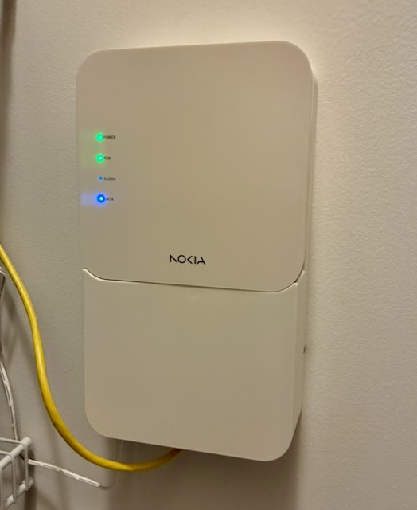
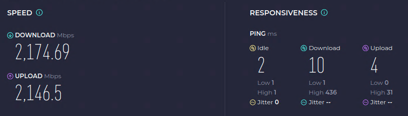

Heading into 2026 I started putting together my [Homelab](/homelab) which means more self-hosting of various services. One concern that I had was egress bandwidth when my family is mobile or I am backing/syncing data to the cloud. Historically, we have had cable internet from Xfinity offering 300 Mb down and 50 Mb up speeds. That has served us well for the last 10+ years we have lived in our current home. But, the slower speeds may prove to be a bit of a challenge with some of the goals I had in mind. Also, even I wanted to upgrade our current plan, I would need to upgrade my modem hardware and still not the kind of upload speeds I was looking for. So, I started looking at what other options were on the table.

Our town has had a fiber optic backbone running through it for quite some time, but it was difficult for an average resident to get access without figuring out a last mile solution to get it to your home. Obviously, that's not really feasible for most. That all changed in the last year as a small regional company footed the bill to run fiber service through all neighborhoods in town. After this was complete, they opened for business and started offering symetrical speeds up to 8 Gb to residential customers. And, these speeds were faster and much cheaper than the cable or other options available in our area.

As we came into the end of 2025 I assumed any gremlins would have been worked out of the system, I decided to pull the trigger on a 2 Gb symetrical plan. An install was scheduled for the first with of January and the whole process seemed pretty organized. The tech and I went back and forth a bit on install options and locations, but we were able to successfully find a line routing and ONT mounting location that was suitable. Overall, the install is quite clean and close to my network equipment in the closet.

It's only been a couple weeks with the new service, but the speed and reliability have been great thus far. I have also paired this with some upgraded Unifi access points in our house so we can further take advantage of the new bandwith. I have also run more Cat 6A in our house for additional 2.5 Gbe (and 10 Gbe) wired connections so they can take advantage as well. I will cover more of this in a future update. I'm looking forward to continue building out my homelab and onboarding more services that will benefit from the bigger pipe.

