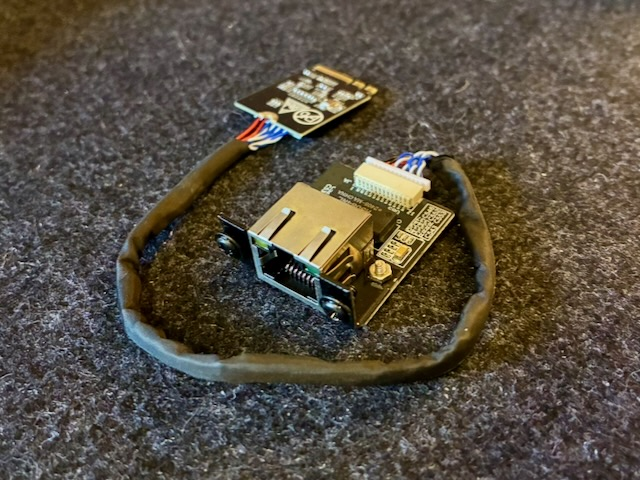
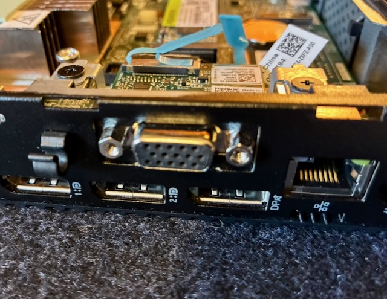
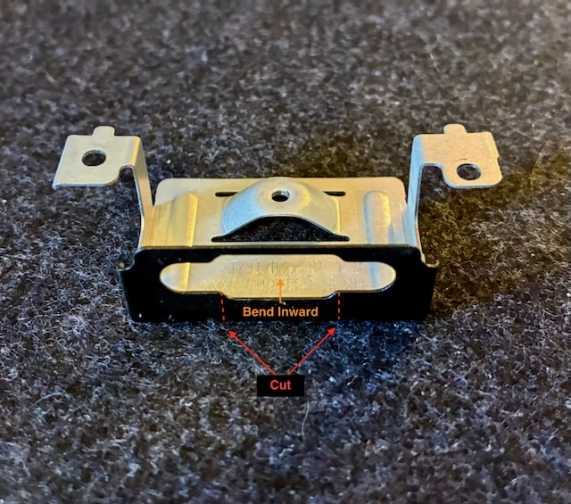
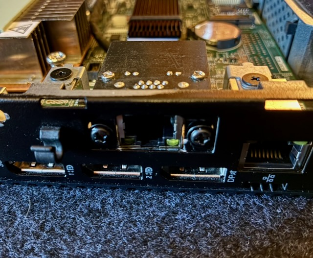
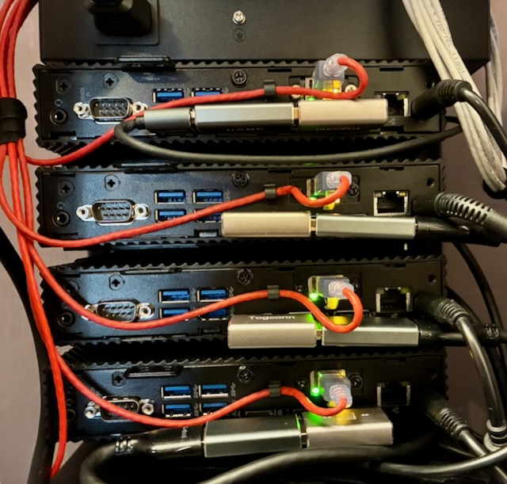
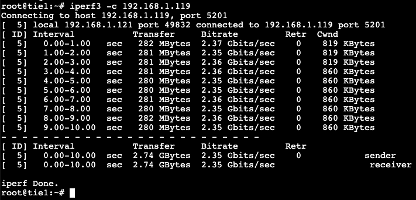

I have four Dell Wyse 5070 Thin Clients in my [Homelab](/homelab). Over the last couple months, I have made a few modifications to make them more capable as compute nodes in my [Proxmox](https://www.proxmox.com/en/) cluster. This includes upgrading the RAM to 16 GB (from 8 GB) and swapping the standard 32 GB SSD for 256 GB units. With a low-power 4 core CPU and the whole system being passively cooled, this is a modest, but efficient and capable little compute unit. 

Given that I use a 2.5 Gbe switch for the cluster, I wanted to find a way to see if I could upgrade the standard Gbe built-in NIC. This will help speed up tasks like backups, replications, and quicker failover during HA events. Also, I have containers running my Tailscale subnet router so I'd like to be able to fully utilize my [2 Gb fiber](/blog/wan-upgrade/) connection to serve my remote devices. The Wyse unit is quite compact and is very limited on expansion outside something like USB peripherals. However, mine do have an unused M.2 A+E Key slot reserved typically for a Wifi card. And, it should have the PCIe bandwidth to support the networking throughput I'm looking for.

I began looking for ethernet hardware that can leverage the extra M.2 slot and stumbled upon a few different options. Ultimately, what I landed on was a [youyeetoo 2.5G Ethernet Card](www.youyeetoo.com/products/25g-m2-ethernet-card). It is designed to fit into the an M.2 A+E slot and provide a mountable port somewhere else on a PC chassis. What I liked about this adapter is that it utilized an Intel i226-V chipset which will be excellent for compatibility and performance. The i225 chipsets have historically had a lot of issues, but from my research it seems Intel resolved a lot of that in the i226. Also, the adapter comes in different cable lengths and the 20 cm option fit well within the Wyse chassis. 

The plan was to leverage an existing flexible port opening on the Wyse chassis currently being occupied by a VGA port. The opening provides enough space for an ethernet port, but I would have to replace or modify the VGA adapter mounting hardware to make it work. Another option I had considered was 3D printing a bracket.

After taking some measurements and test fitment, the approach I landed on was modifying the VGA adapter bracket. As you can see in the picture below, all I had to do was make two small cuts at the bottom of the backplate, then bend the remaining table backward 90 degrees until it's flat. This gives enough room for the ethernet port hardware to fit in the square cutout. Also, the result appears relatively clean without much noticeable "hacking".

For mounting the port, the supplied screws work sufficiently in the existing VGA port screw openings. While it's not a perfect fit, the screw heads are wide enough to sandwich the lower half of the bracket securing the unit tightly in place. As you can see below, I'm quite happy with the final installed fit.

After the port is installed, the M.2 A+E card can be inserted in the opening on the motherboard. The adapter comes with a screw to attach the card to the M.2 mounting post. I routed the cable around the other M.2 slot housing the system SSD. In the picture below, you can see the final installed product along with some of the other upgrades of made.

And, with the upgraded nodes installed back into my mini rack. I really love the [Monoprice Snagless SlimRun](https://www.monoprice.com/product?p_id=29474) cables. They are well-made, flexible, and small which is perfect for routing in tight spaces like this.

One last step after reassembling everything was to make sure the "Wireless Device" is set to enabled in the BIOS. If your Dell Wyse did not include Wifi hardware, chances are that this setting will be disabled (and non-functional) like mine. Once booted into Proxmox, the device was recognized and I changed the ethernet bridge use the 2.5 Gb NIC instead of the existing 1 Gig unit.

As you can see, the new NIC works pretty well and nearly saturates a 2.5 Gbe connection. I'm excited to start running workloads and normal operations on these units to see how they perform on real use cases.