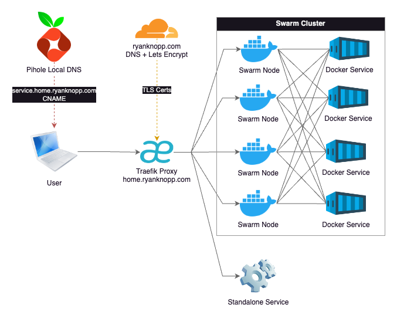

There are many challenges and problems to solve for when setting up and running my [Homelab](/homelab). After the infrastructure was setup and the cluster was configured, I started running various services and applications. Initally, most of my services have been focused on running operations (Observability, Container Orchestration, DNS, etc). Once these were stable, I started moving on to end-user applications. Regardless of service type, they all have a common set of needs. I quickly found that I needed a solution for accessing services via friendly URL, routing of all the various ports and IPs they run on, and serving them with a legitimate TLS certificate. A [reverse proxy](https://en.wikipedia.org/wiki/Reverse_proxy) was clearly the next service I needed to put in place.


I chose to use [Traefik](https://traefik.io/traefik) as my homelab reverse proxy. It's mature, well-documented, and relatively simple service to setup. It's also a preferred choice for serving K8s, Swarm, or other cluster setups. It provides routing, load balancing, service discovery, and TLS certificates ticking all of the boxes that I had on my requirements list. 

While you can deploy Traefik directly into a [Docker Swarm](https://docs.docker.com/engine/swarm/), I instead to deployed it in a standalone Docker VM on my Proxmox Cluster. The rationale for this is that I can still keep a single static IP for the proxy for the purposes of local DNS. Also, the VM is replicated and can be migrated or fail over to other nodes in my cluster as a high-availability setup. The Swarm has multiple IP addresses and while I could technically point the DNS record at one of those (due to Swarm's internal load balancing), I chose not to. This gives me the option of taking one or more of those Swarm nodes offline without having to potentially update DNS. There are some options for putting another load balancer in front of Traefik running multiple instances in the cluster but this seemed overkill and too complex for my situation. 

I also have other services that sit outside of the Swarm cluster either as a standalone [Proxmox](https://www.proxmox.com/en/) LxC/VM or external service hosted else where on my network. Some of these services include a [Tailscale Subnet Router](https://tailscale.com/docs/features/subnet-routers/how-to/setup), [TrueNAS](https://www.truenas.com/), [Unifi Control Plane](https://help.ui.com/hc/en-us/articles/30127033090071-Choosing-the-Right-UniFi-Control-Plane), and even my Brother laser jet printer. Once the pattern was setup, I found it quite easy and nice setup all services in the same way. 



I won't go into all the details of the configuration as most of this is well-documented across the Internet. However, I will highlight some basic design choices I made:

- [Pihole](https://pi-hole.net/) serves as my local DNS. I have an A Record here for ```home.ryanknopp.com``` that points to the IP address of the Traefik VM. All services have CNAME records at a subdomain of ```subdomain.home.ryanknopp.com``` which point to ```home.ryanknopp.com```. The CNAME approach allows me to change the IP of Traefik in the future on one record instead of every subdomain if I need to. I also have multiple instances of Pihole for redundancy and synced via [Nebula](https://github.com/lovelaze/nebula-sync).
- Traefik is hosted on dedicated VM in Docker. The service is configured to pull static and dynamic configuration files from a mounted NFS share on my NAS. The dynamic configuration file is where I setup my service HTTP routers and load balancers to proxy requests to either the Swarm cluster IPs or a single service IP. This is also where ports are mapped from whatever the service is running to standard 80/443.
- I am currently not using Traefik-specific Docker labels for automated discovery. This proved to be a bit a challenge given that the proxy is not on cluster. Also, I believe I needed to extend a network across all of the services. I find it's not that much work to edit the dynamic configuration file each time I want to add/remove/modify a service.
- Traefik connects to Cloudflare to validate DNS ownership of ```ryanknopp.com``` and then uses [ACME](https://en.wikipedia.org/wiki/Automatic_Certificate_Management_Environment) and [LetsEncrypt](https://letsencrypt.org/) to create a TLS wildcard certificate that is used by the various services' subdomains and terminated at the proxy. This is stored in a JSON file also on my NFS share and mounted to the Traefik container.

Overall, I'm happy the performance and setup of this solution. As I scale this up and learn more about capabilties and limitations, I'm sure I'll evolve the design. For now, I'm trying to keep this simple and functional. Please find a couple references that I found extremely valuable to making this work.

- https://technotim.com/posts/traefik-3-docker-certificates/
- https://doc.traefik.io/traefik/setup/docker/