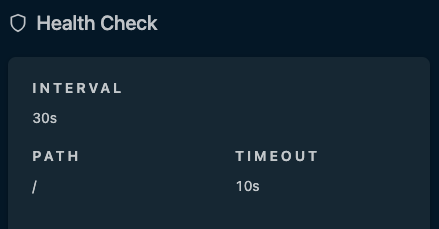

My [Traefik Proxy](/blog/2026-02-09-traefik-swarm/) has been running quite well over the last several weeks, providing encrypted, load-balanced forwarding to services running in my Docker Cluster and Homelab. Well, until recently. Yesterday I decided to perform some maintenance on one of the services running in my cluster nodes. I updated a dependency that ended up taking one of nodes offline. No problem I thought, [Swarm](https://docs.docker.com/engine/swarm/) should detect the node being offline and spin up the services on other nodes. And it did just that, as expected. However, I was still getting lots of alerts from [Uptime Kuma](https://uptimekuma.org). Services were going up and down like crazy.

After a little more digging, I realized the problem. While the cluster was adapting quite nicely, my [Traefik](https://traefik.io/traefik) proxy was still attempting to load-balance to all nodes in the cluster, including the unhealthy node. Embarassingly, I realized I made a complete oversight in the design in not anticipating this being a possibility. And, Traefik has a simple solution to address this: [Health Check](https://doc.traefik.io/traefik/reference/routing-configuration/http/load-balancing/service/#health-check).

Health Check periodically checks each server listed under a service and verifies that it is healthy. If it is unhealthy, it is removed from the load balancing rotation. A very simple solution that I fixed with an extra parameter in my dynamic configuration. I hope my HA homelab is now a little more HA. 😅