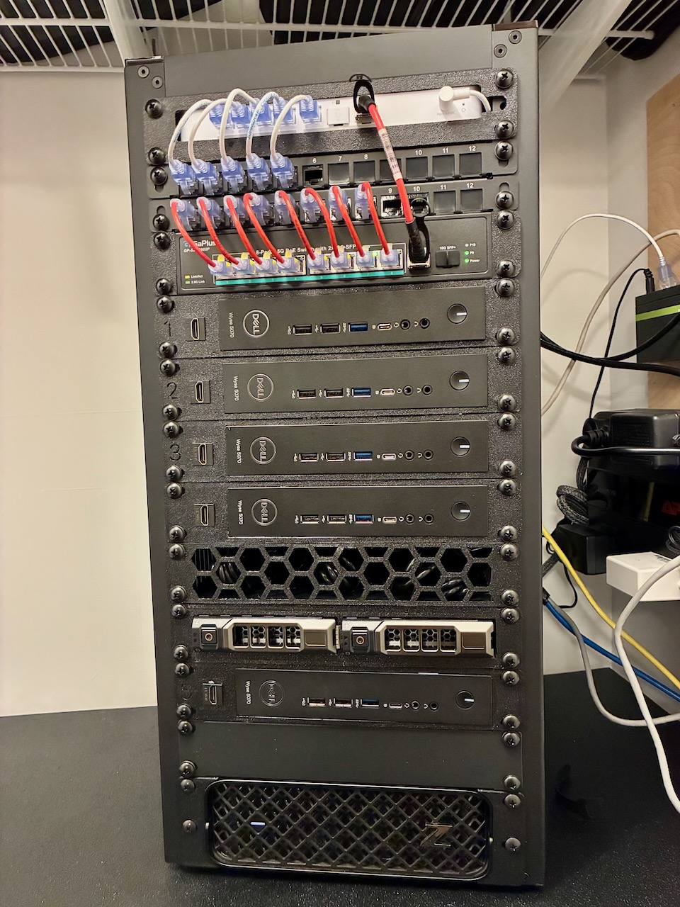
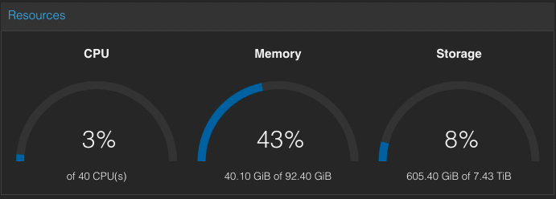

# Homelab Overview

My Homelab is a stack for me to learn, tinker, and test different technologies for both professional development as well as personal interest. It is inspired by individuals and communities such as [Jeff Geerling](https://www.jeffgeerling.com/), [Techno Tim](https://technotim.com/), [ServeTheHome](https://www.servethehome.com/), [r/homelab](https://old.reddit.com/r/homelab/), [r/minilab](https://old.reddit.com/r/minilab/), and many others. Homelabs come in many sizes, shapes, and flavors, but I chose to specifically go down the Minilab route. The intention here is to keep things relatively simple, efficient, and sustainable.

In this overview, you will find a high-level summary of the various components in the stack. Over time, I will create detailed documentation broken out into individual documents and available on the sidebar left. It will evolve over time and my goal is to keep this up to date to reflect the homelab's current configuration.

## Hardware

The current homelab cluster is a series of 6 nodes. Five nodes are part of a Proxmox cluster to host and run services. One node is used as a TrueNAS server. These are all connected to a 2.5 Gbe unmanaged switch which is then paired to a router. The NAS has a 2-bay hotswap 3.5" inch HDD enclosure. Power supplies, additional fans, and various cables/connectors/adapters round out the components. All of this is is housed in a 10" Mini Rack with various off the shelf and 3D printed fixtures.

### Compute Nodes

My compute nodes consist of one [HP Z2 G9 Mini](https://support.hp.com/us-en/document/ish_6068870-6068917-16) and four(4) identical [Dell Wyse 5070](https://www.dell.com/support/manuals/en-us/wyse-5070-thin-client/5070_std_ug/physical-specifications?guid=guid-23626e93-07d2-47a3-9c3d-d467c2f29db0&lang=en-us) thin clients. All of these were purchased used off of ebay at a significant discount over new. The strategy here is to have one node with enough power to run a variety of unique or more intense workfloads and the remaining nodes run more standardized, highly available, and consistent workloads. All of them are running in a [Proxmox](https://www.proxmox.com/en/) cluster which I describe in more detail under Hypervisor.

The Z2 G9 Mini has an [Intel Core i7-13700](https://www.cpubenchmark.net/cpu.php?id=4992&cpu=Intel+Core+i7-13700) with 16 cores (24 threads). It also has 32 GB of DDR5 5600 RAM which I hope to upgrade to 64 or 128 GB if ram prices come back down. It has a 1 TB Gen4 NVME SSD along with an additional 2.5 Gbe NIC that I have bonded with the standard Gbe port. Lastly, I added an additional 2 TB Gen4 NVME to run various VM and container images in my ZFS pool for high availability. 

The Dell Wyse 5070 thin clients run the [Intel Pentium J5005](https://www.cpubenchmark.net/cpu.php?cpu=Intel+Pentium+Silver+J5005+%40+1.50GHz&id=3144) processor with 4 cores. Certainly not powerful, but efficient and can run lightweight containers and services. I have modified these units to no longer be totally "thin". Each one has upgraded ram to 16GB DDR4 2666, a 256GB M.2 SATA III drive, and a 2.5 Gbe port through the M.2 Wifi interface via custom adapter. All in, I am just under $100 per node including base cost of the system plus the modifications I've made.

### NAS

The NAS, currently, is another Dell Wyse 5070 thin client with the same modifications as the compute nodes. It has two 3.5" 2TB HDDs connected via USB and running in a ZFS mirror. The operating system is [TrueNAS](https://www.truenas.com/). The NAS is serving the cluster for three purposes: backups, VM/Container image storage, and a shared NFS dataset for a Docker Swarm cluster I have running across all 5 compute nodes. 

This setup is temporary as I was using it to validate the initial design and configuration. It will be replaced in the future with a custom build that will include 10 Gbe, more RAM, and likely a couple of NVME drives for performant storage needs. More to come on that.

### Switch

The switch is a [GigaPlus 10-port 2.5 Gbe](https://gigaplustech.com/products/10-port-2-5gb-unmanaged-poe-switch-with-8-2-5g-base-t-poe-ports-2-10g-sfp-uplink-802-3af-at-poe-80gbps-switching-capacity-gigaplus-2-5g-poe-switch-for-2-5gb-nas-pc-wifi6-router-wireless-ap) unmanaged unit. Eight of the ports are 2.5 Gbe PoE although I am not using the PoE capbility that this time. I like having the option in if a I need it down the road. It includes two 10 Gb SFP+ ports as well; one that I'm using to uplink to my router and the other plan on connecting to my NAS by RJ45 transceiver. This is suiting my needs for now as I only have 1 VLAN on the cluster network and I can manage that fine through my router. If that changes down the road I will look at a layer 2 or 3 switch.

### Router

The router is a [Unifi Cloud Gateway Fiber](https://store.ui.com/us/en/category/all-cloud-gateways/collections/cloud-gateway-fiber/products/ucg-fiber) with four 2.5 Gbe ports (1 PoE), a 10 Gbe RJ45 port. and 2 10 Gb SPF+ ports. While some ports are labeled WAN, you can configure any of them to be primary or secondary WAN which is very convenient. Currently, I'm using one of the SFP+ ports to connect my switch, the 10 Gbe RJ45 as a WAN port to my 2 Gb Fiber Internet connection, and the remaining 2.5 Gbe ports used for access points, switches, and other devices to support connectivity throughout the house. It is configured with multiple VLANS supporting different networks as well as multiple Wifi networks.

### Mini Rack

The rack unit is a 10" (half-width) rack that has become very popular in the last few years. The specific rack used here is a [DeskPi Rackmate T2](https://deskpi.com/products/deskpi-rackmate-t2-light-version-10-inch-black-12u-server-cabinet-for-network-servers-audio-and-video-equipment) in black. The rack offers 12U of vertical space and comes with a couple shelves, blank/vented panels, and a 12 count keystone jack panel. I have purchased additonal vents and keystone jack panels. In the back are four 80mm pc fans controlled by a USB fan controller.

The racks for holding the hardware are all 3D printed out of PETG filament. The router and HDD bays are 3rd party models I found online. The Wyse racks, cover panels, PDU rack, and fan controller unit were all designed by me in [FreeCad](https://www.freecad.org/).

<!-- 
## Network

More to come here

## Hypervisor

## Platform & Automation

## Services -->
